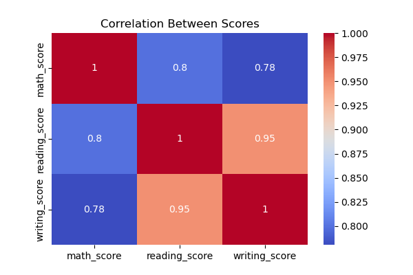
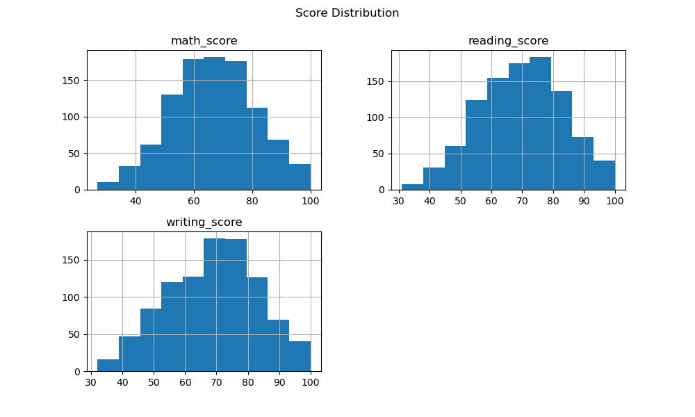
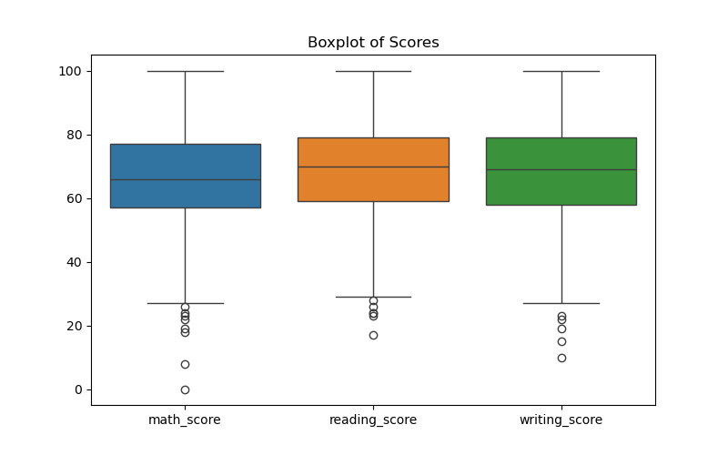

## 📸 Sample Visualizations





\# Student Data Cleaning \& Visualization


\## 📌 Objective

To clean and analyze student performance data and extract meaningful insights using data visualization.


\## 🛠️ Tools Used

\- Python

\- Pandas

\- Matplotlib

\- Seaborn

\- Jupyter Notebook


\## 📂 Project Structure

\- data/ → raw dataset  

\- notebooks/ → analysis notebook  

\- outputs/ → cleaned dataset and plots  


\## 🔧 Steps Performed

\- Removed duplicate records  

\- Handled missing values  

\- Standardized column names  

\- Detected and removed outliers  

\- Created visualizations  


\## 📊 Key Insights

\- Students who completed test preparation scored higher  

\- Reading and writing scores are strongly correlated  

\- Gender-based differences exist in performance  


\## ▶️ How to Run

```bash

pip install -r requirements.txt

jupyter notebook


\---


\## 🔹 5. Initialize GitHub Repo


Open terminal in your project folder:


```bash

git init

git add .

git commit -m "Student data cleaning and visualization project"

